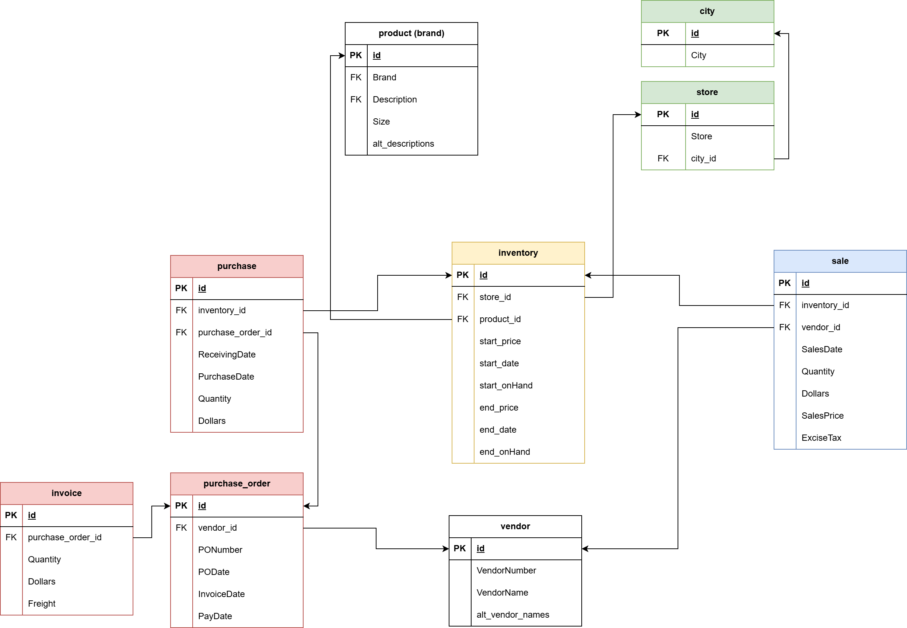

# Data Engineering Stack Demo
This repo contains a modular and extensible demo stack for Data Engineering workflows, using open-source tools. 

# Source datasets
- Drink distribution company
Case study from PwC. [Download here](https://www.pwc.com/us/en/careers/university-relations/data-and-analytics-case-studies-files.html)
- Taxi industry
TLC Trip Record Data from NYC. [Download here](https://www.nyc.gov/site/tlc/about/tlc-trip-record-data.page)

# Stack components

## 1. PySpark + Jupyter = ETL
To automatically download, unzip, normalize tables and save them into a postgreSQL database.
Requires [Docker](https://www.docker.com/get-started/)
```bash
docker-compose build
docker-compose up -d
docker-compose logs pyspark-notebook --follow
```
- Run jupyter notebooks files from `notebooks/` via VSCode or by using http://localhost:8888/ + token
- Use Ctrl+C to Stop or `docker-compose down`
## 2. Metabase = Data Visualization
```bash
docker-compose up -d
docker-compose logs metabase --follow
```
- Access Metabase dashboard from http://localhost:3000/
- Use Ctrl+C to Stop or docker-compose down

## 3. Airflow (Astro CLI) = Workflow Orchestration
Requires [Astronomer](https://www.astronomer.io/docs/images/astro/cli/install-cli/?tab=windowswithwinget#install-the-astro-cli)
```bash
cd airflow
astro dev start
docker exec -it da-spark-master chmod 777 storage 
```
- Access via http://localhost:8080/
# TODO List
- [x] Set up multi-container stack with Jupyter notebook + Spark for local development
- [x] Download .csv files and unzip them 
- [x] Normalize tables using PySpark
- [x] Configure PosgreSQL DB and write table outputs
- [x] Use psycopg2 to add PK and FK constraints into Database
- [x] Finish basic Airflow (Astro) configuration for master and worker setup
- [x] Set up basic DAG example for data ingestion
- [x] Fix spark-worker without write permissions
- [x] Migrate notebooks files to new DAG in Airflow environment
- [ ] Configure daily scheduler and conditional download based on filename (DAG)
- [x] Set up Metabase app for easy-to-use data visualization
- [x] Create meaningful visualizations in Metabase 
- [ ] Migrate parquet to delta lake to allow for efficient storage of historical records
- [ ] Deploy Airflow (Astro) setup Astronomer Cloud
- [ ] Databricks integration: Migrate SparkSubmitOperator to DatabricksSubmitRunOperator
- [ ] Storage migration: use AWS S3 buckets instead
- [ ] Database server migration: use AWS RDS service


#  Drink distribution company: ERD
[](https://viewer.diagrams.net/?tags=%7B%7D&lightbox=1&highlight=0000ff&edit=_blank&layers=1&nav=1&title=DER%20inventory_analysis&dark=auto#Uhttps%3A%2F%2Fdrive.google.com%2Fuc%3Fid%3D1_B1yiPsM6hpgth14rVbpCK10uO4eSjG3%26export%3Ddownload)
# Stack Screenshots
.png>)
.png>)
.png>)
.png>)
.png>)
